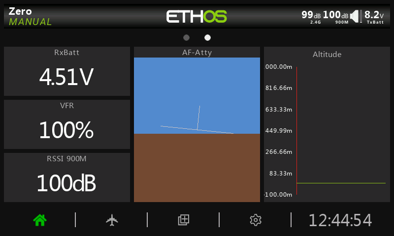
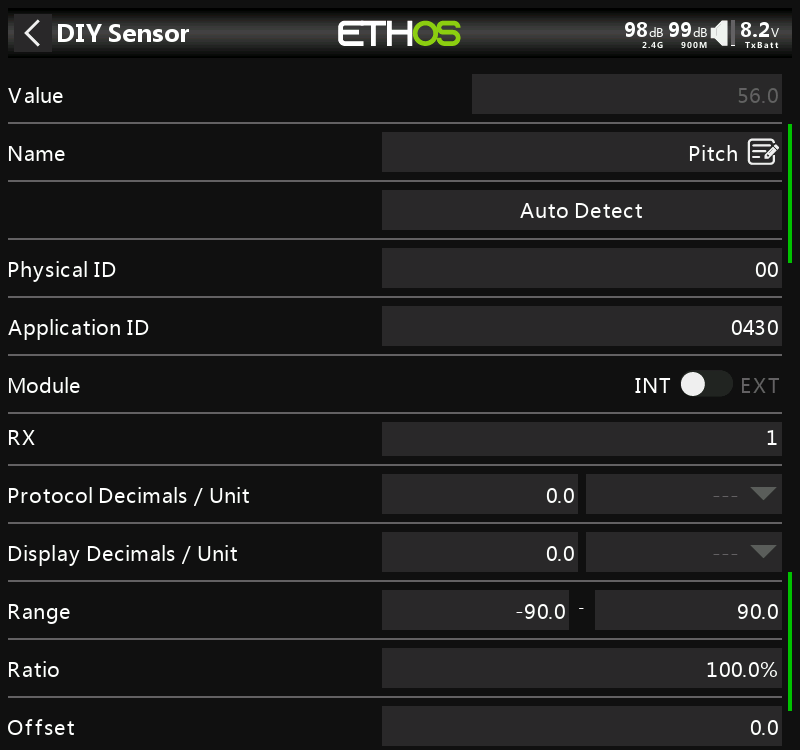
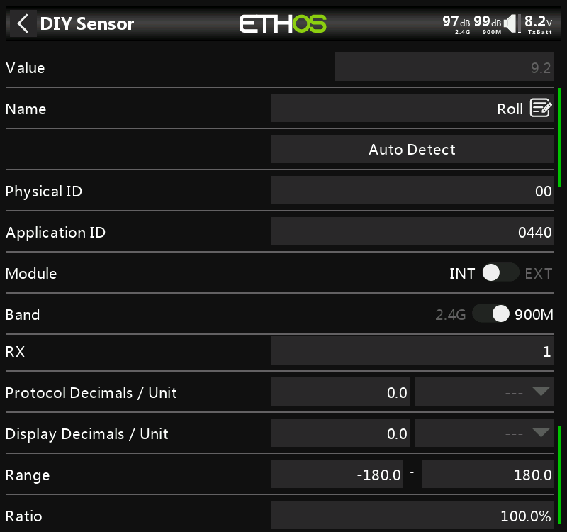

# Inav attitude indicator for Ethos

1. Copy folder **scripts/af-atty** to transmitter sd-card.
1. Discovery telemetry sensors.
1. Click on screen and add new screen/widget. Select **AF-Atty**.
1. If you use TBS/ELRS - enjoy.

## For TW/TD/R9 users
### Configure INAV
1. In Inav console type: `set frsky_pitch_roll=ON` and save config

### Create sensor Pitch
1. Rediscovery telemetry sensors
1. In telemetry window press **Create DIY sensor**
1. Type name `Pitch`
1. Press **Auto Detect** and select `0430` sensor
1. Set **Protocol Decimals/Unit** to `0.0`
1. Set **Display Decimals/Unit** to `0.0`
1. Set **Range** from `-90` to `90`

### Create sensor Roll
1. In telemetry window press **Create DIY sensor**
1. Type name `Roll`
1. Press **Auto Detect** and select `0440` sensor
1. Set **Protocol Decimals/Unit** to `0.0`
1. Set **Display Decimals/Unit** to `0.0`
1. Set **Range** from `-180` to `180`

